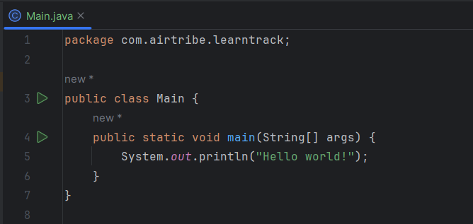
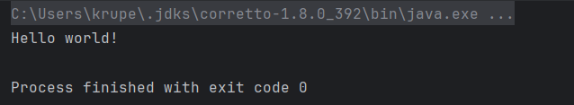

JAVA version :- 1.8

>`public class Main`

Defines a class named Main. In Java, every program must be inside a class. The class name should match the file name (Main.java).

>`public static void main(String[] args)`

This is the entry point of a Java program.

- **public** :- JVM can access it from anywhere

- **static** :- JVM can call it without creating an object

- **void** :- does not return any value

- **String[] args** :- command-line arguments

>`System.out.println("Hello world!");`

Prints the text Hello world! to the console.

- **System** :- built-in class

- **out** :- output stream

- **println** :- prints text and moves to a new line

>What happens when you run it..

1. JVM starts execution from main()

2. The print statement executes

3. Output appears on the console